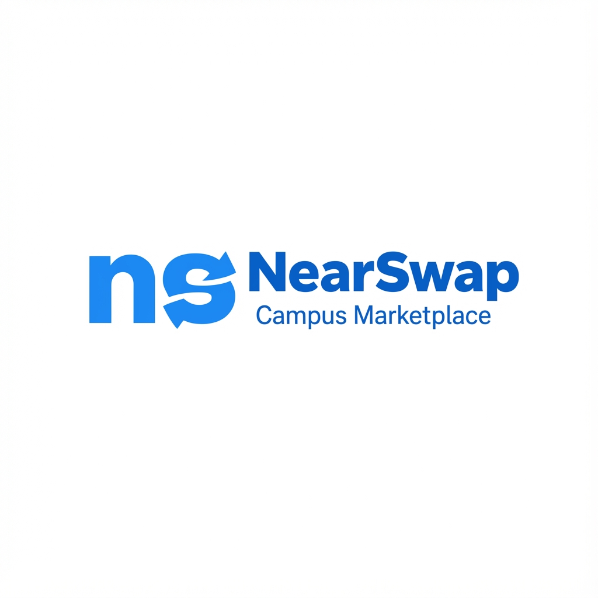

# NearSwap - Campus Marketplace

NearSwap is a hyper-local marketplace designed specifically for university campuses. It allows students to buy, sell, and swap items securely within their college community.



## 🚀 Features

- **Campus-Centric**: Exclusive to verified students (requires .edu email).
- **Buy, Sell, Swap**: distinct modes for commerce and trading.
- **Interactive "How to Use" Demo**:
  - High-fidelity phone simulation.
  - Inline video playback.
  - Interactive scroll animations.
- **Platform Overview**: Clean "Platform Features" section highlighting key benefits.
- **Responsive Design**: Fully optimized for mobile, tablet, and desktop.
- **Modern UI/UX**:
  - Glassmorphism effects.
  - "Bouncy" interactive elements.
  - Smooth scroll animations.

## 🛠️ Technology Stack

- **HTML5**: Semantic structure.
- **CSS3**: Modern styling with Flexbox, Grid, Animations, and Variables.
- **JavaScript (Vanilla)**:
  - `IntersectionObserver` for scroll animations.
  - Dynamic interactions (Video player, Carousel).

## 📂 Project Structure

```
NearSwap - Website/
├── assets/              # Images and icons (logos, phone screens, etc.)
├── index.html           # Main landing page
├── style.css            # Global styles and responsive design
├── script.js            # Interactivity and animation logic
└── README.md            # Project documentation
```

## ⚡ Getting Started

1.  **Clone the repository** (or download source).
2.  **Open `index.html`** in your browser to view the site.
    *   *Note: For the best experience with local assets, run a local server.*

### Running with Python (Simple Server)

If you have Python installed, you can start a local server instantly:

```bash
# In the project directory
python -m http.server 8000
```

Then visit `http://localhost:8000` in your browser.

## 📈 Analytics (GA4)

This website supports Google Analytics 4 via [analytics.js](analytics.js).

1. Create a GA4 property and get your Measurement ID (format: `G-XXXXXXXXXX`).
2. Open [analytics.js](analytics.js) and replace `G-XXXXXXXXXX` with your real ID.
3. Deploy to Netlify (or your host). The script loads automatically on all pages.

## 🎨 Design Highlights

- **Header**: Sticky navigation with a transparent-to-solid transition.
- **Hero Section**: Carousel with emotional imagery and clear call-to-actions.
- **Demo Section**: A 16:9 landscape device frame featuring a "Dynamic Island" style camera and inline video player.
- **Get the App**: A realistic CSS-only representation of the Play Store listing.

## 📱 Browser Support

- Chrome (Recommended)
- Firefox
- Safari
- Edge

---

© 2024 NearSwap Inc. All rights reserved.
